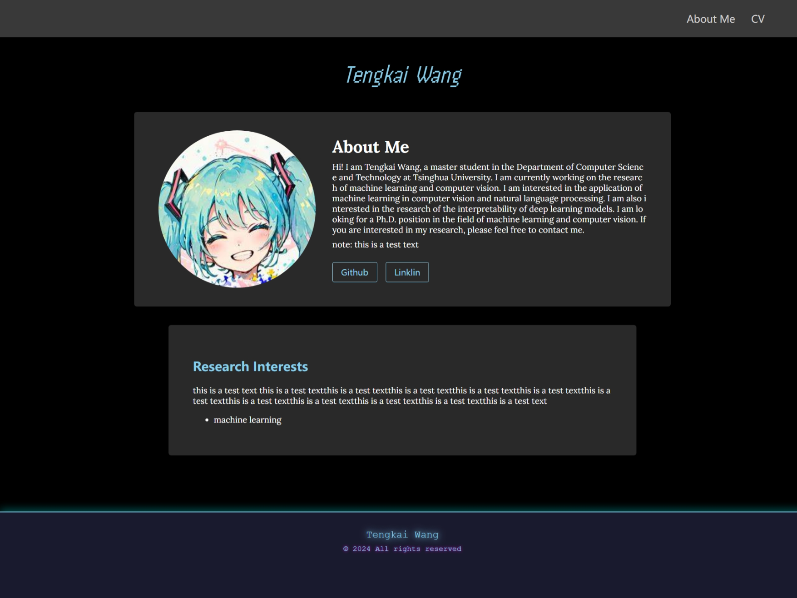

## How the final page look like.



## How to use the profile-ui

The profile-ui aims to make making a profile page easier.

open the index.html, then edit your profile.

* personal-name tag

```html
<personal-name>
    Your Name here
</personal-name>
```

* personal-card tag

```html
<personal-card 
    avatar-src="your avatar src"
    link1-name="Github"
    link1-ref=""
    link2-name="Linklin"
    link2-ref=""
> 
    # About Me
    
    text
    note: you can write  markdown text here
</personal-card>
```
* info-card tag

```html
<info-card>
    # Research Interests
                
            
    * machine learning
</info-card>
```

In this tag, only the first head will be translated to the title of the box, others will stay as markdown.

* my-footer tag

```html
<my-footer>Tengkai Wang</my-footer>
```

* gap-e tag

    offer you a vertical gap between any elements.

### Tip!

Regard the original index.html as a demo to play.


